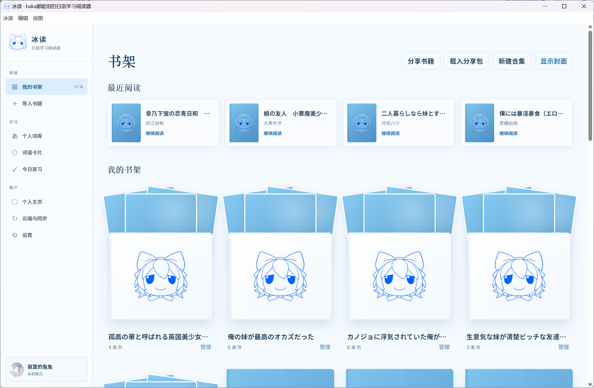
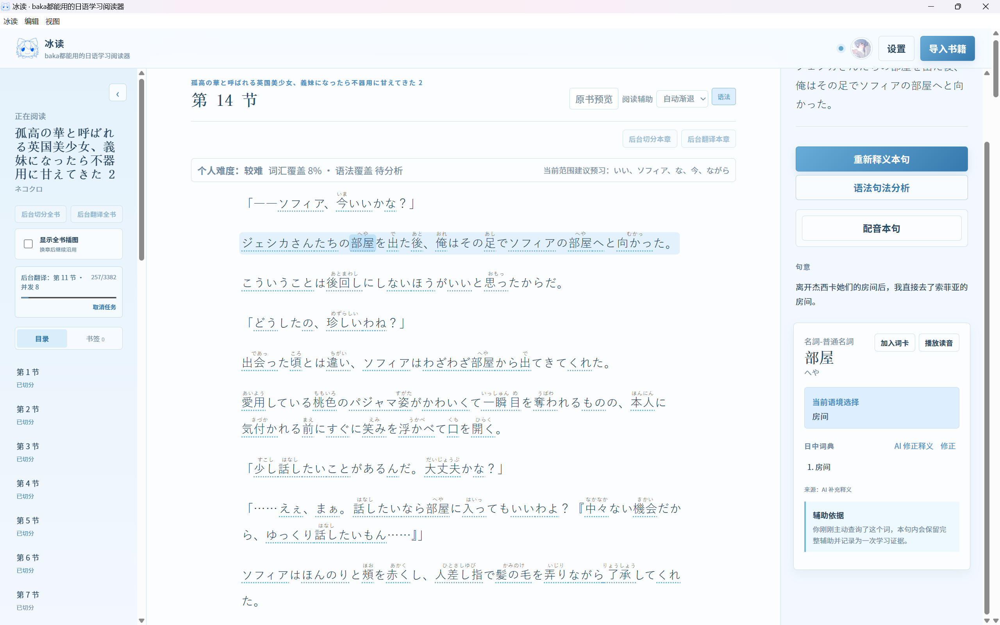
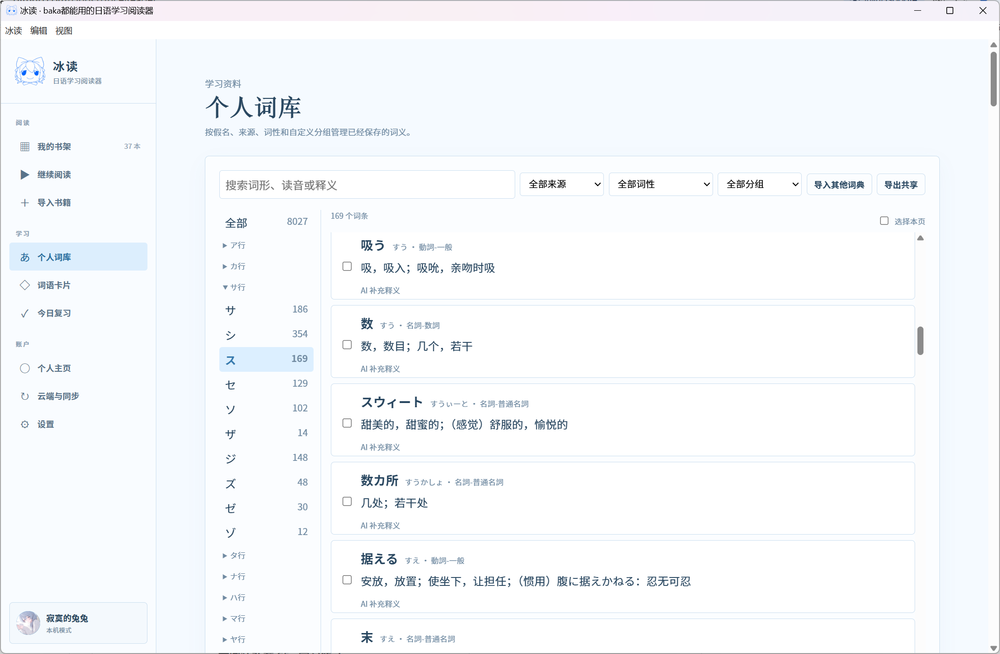
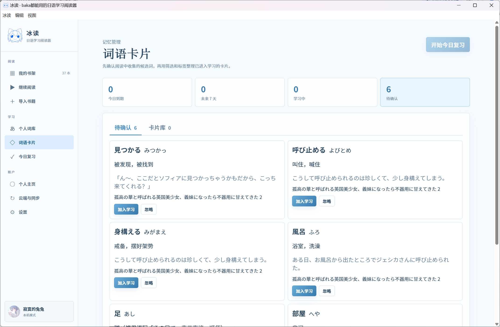
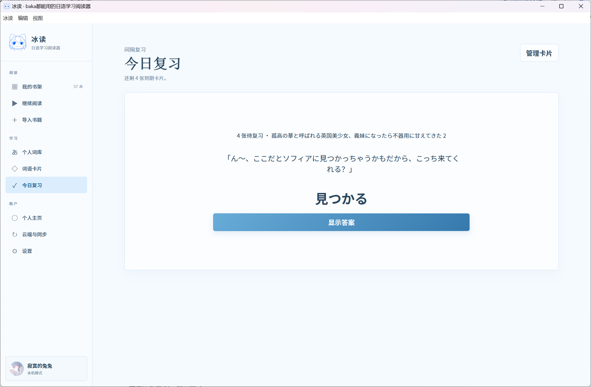
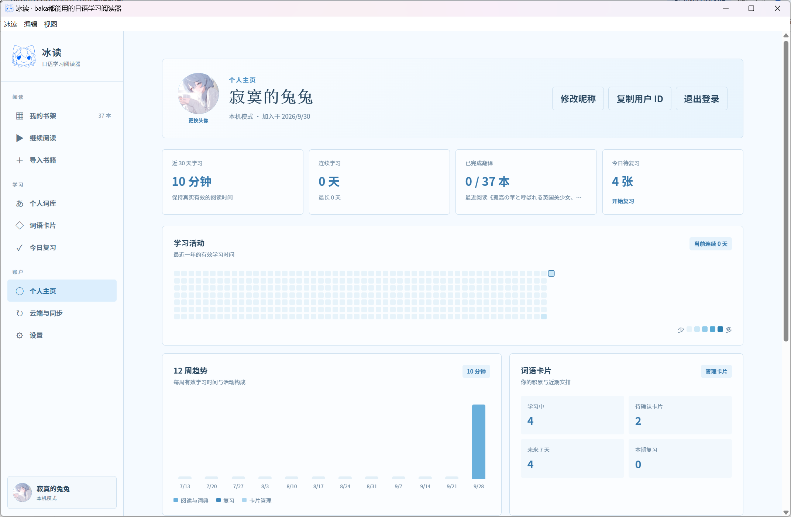
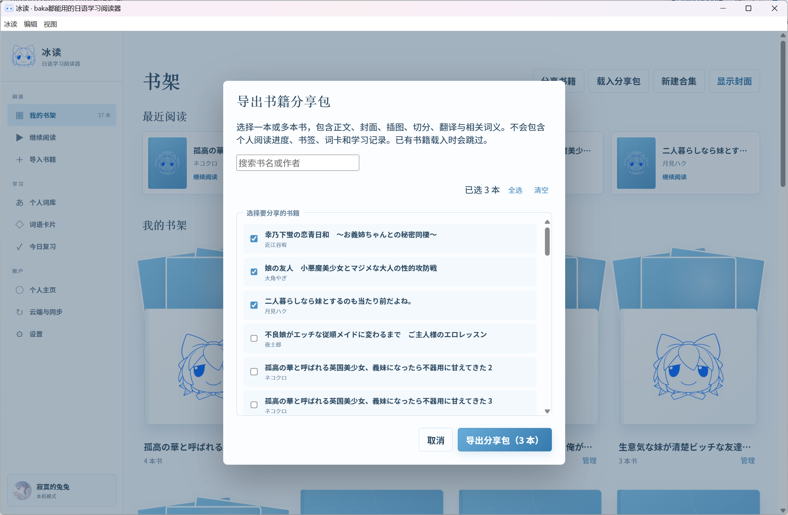
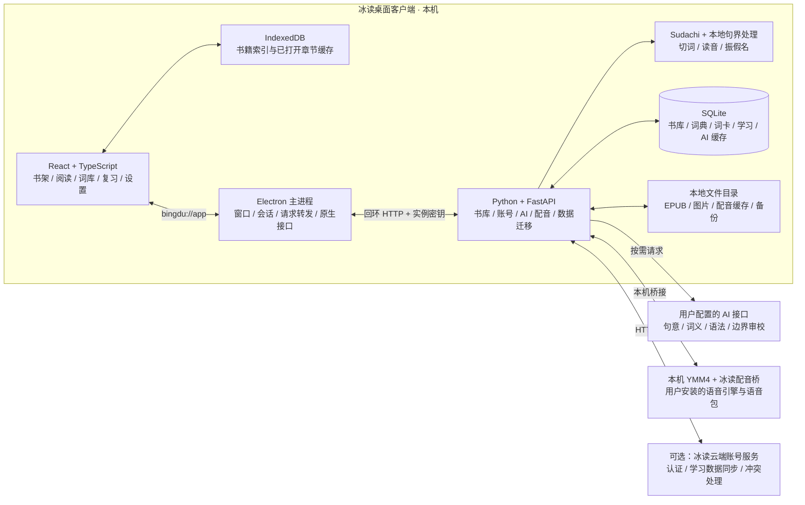

<p align="center">
  
</p>

<h1 align="center">冰读 · IceReader</h1>

<p align="center"><strong>让baka都能好好读书</strong></p>
<p align="center">从喜欢的日文开始，把阅读、理解、积累和复习连在一起。</p>

<p align="center">
  <a href="LICENSE"></a>
  
</p>

<p align="center">
  <a href="#快速开始">快速开始</a> ·
  <a href="#功能介绍">功能介绍</a> ·
  <a href="#分享与数据迁移">分享与数据迁移</a> ·
  <a href="#架构概览">架构概览</a> ·
  <a href="#开发与构建">开发与构建</a> ·
  <a href="#第三方与内容许可">许可证与源码</a> ·
  <a href="https://github.com/H0rR1p/IceReader/issues">反馈问题</a>
</p>

---

冰读是一款面向日语学习者的 **Windows 桌面阅读器**。导入 EPUB、TXT 或粘贴日文后，你可以在阅读中查看振假名、理解句意和语法，把遇到的词加入卡片，并通过间隔复习逐渐减少对阅读辅助的依赖。

书籍与学习数据保存在本机。已有正文、分析结果和复习内容可离线使用；生成新的 AI 释义和语法分析需要配置自己的接口。配音可连接本机 YMM4。

> **版本说明**：`main` 为本地桌面客户端，[`Online`](https://github.com/H0rR1p/IceReader/tree/Online) 为公网 Web 版本。桌面版无需云账号即可使用，也可通过数据迁移包将书籍、卡片和学习记录带到云端账号。



## 功能介绍

### 在原文中理解日语

- **封面默认隐藏**: 想在外面读一些封面尴尬的书？打开阅读器怕被人看见？本产品默认隐藏图书封面，出门在外不怕尴尬。
- **导入与整理**：支持无 DRM 的 EPUB、UTF-8 TXT 和粘贴文本；支持合集、自定义封面和最近阅读。
- **日语阅读辅助**：本地切词、词典形、读音与振假名；点击词语查看词义和当前语境义。
- **逐句理解**：快速句意生成中文译文；完整释义额外补充词典未命中的词义。语法句法分析单独按需生成，指出句中使用的结构。
- **释义修正**：发现词义不合语境时，可使用「AI 修正释义」，查看预览后确认保存；也可手动修正个人词库。
- **阅读定位**：保存章节和句子进度；支持句子书签、上一节／下一节和「继续阅读」。左右侧栏均可收起。
- **原书与插图**：支持原书预览，插图开关按书统一管理。实际封面每次启动默认隐藏，书内插图默认关闭。
- **后台处理**：可处理当前章节或全书，显示进度并支持取消；已完成的切分与翻译保留供下次使用。



### 把阅读中的词汇留下来

个人词库提供词形、读音和释义搜索，可按假名、词性、来源与自定义分组浏览，并支持分页、虚拟列表和批量修正。你也可以导入自己有权使用的 Yomitan 格式日中词典。

阅读中的词语可加入词卡；卡片支持标签、筛选、编辑和合并。复习使用四档反馈与每日学习上限，知识状态会参与阅读辅助的调整。



**词卡管理**



**每日复习**



### 看见自己的学习积累

个人主页展示学习时间热力图、连续学习天数、近期趋势和待复习卡片。你可以设置昵称与头像，并在不同本机资料空间之间切换。



### 听见油库里

连接本机 YMM4 后，可为句子与单词生成配音。支持角色选择、可调语速、本地音频缓存和重新生成；默认语速为 `0.85×`，音高固定。

安装包不包含 YMM4 或专有语音包，使用方式见下方 [配音配置](#配音配置)。

## 快速开始

### 安装客户端

目前提供 **Windows x64** 安装包。使用项目维护者提供的 `IceReader-<版本号>-Setup.exe`，按安装向导选择目录即可。

安装版自带运行环境，日常使用无需安装 Node.js 或 Python。目录版需要保留整个 `win-unpacked` 文件夹，不能只复制其中的 EXE。

### 第一次阅读

1. 以本机模式进入，或选择已有本机账号。
2. 点击「导入书籍」，选择 EPUB、TXT，或粘贴日文。导入完成后停留在书架。
3. 打开书籍，选择章节并切分；已有切分会直接复用。
4. 在设置页配置 AI 接口地址、模型与密钥，再点击「释义本句」或启动后台翻译。
5. 遇到需要积累的词，加入词卡；在「今日复习」中巩固。

**快速句意与完整释义有什么区别？**

| 模式 | 生成内容 | 适合的用法 |
| --- | --- | --- |
| 快速句意 | 中文句意，不补充词语翻译 | 先读懂故事、预先翻译全书 |
| 完整释义 | 中文句意、未命中词的词义与本句语境义 | 逐句学习、积累词汇 |
| 语法句法分析 | 句中的语法结构与简洁说明 | 遇到难句时单独调用 |

AI 接口可能按用量收费。设置页可查看 token、缓存命中、耗时和估算费用；本地切词与已有结果复用不产生 AI 请求。

### 配音配置

1. 自行安装可正常合成语音的 YMM4 及所需语音包。
2. 在设置页的配音区域指定 `YukkuriMovieMaker.exe`，导入包含目标角色的 `.ymmp` 模板。
3. 从角色下拉框选择声音，保存后点击「配音本句」或「播放读音」。

冰读会安装自己的配音桥，由 YMM4 调用其语音引擎。首次安装或更新配音桥时，需要保存项目并完全退出 YMM4，再重新触发配音。生成音频时应保持系统输出设备可用。

配音本身不调用 AI；语音引擎与语音包的使用范围遵循各自许可。

## 分享与数据迁移

### 只分享选中的书籍

在书架点击 **「分享书籍」→ 勾选一本或多本 → 导出分享包**。接收方点击 **「载入分享包」**，即可读取书籍及其已有分析结果。

分享包包含正文、封面、插图、章节、切分、翻译和相关词义。尚未完成的分析会保留已有结果，接收方可继续处理。



### 选择合适的数据包

| 类型 | 入口 | 包含内容 | 用途 |
| --- | --- | --- | --- |
| 书籍分享包 | 书架 → 分享书籍／载入分享包 | 所选书籍、资源、切分、翻译、相关词义；不含个人阅读进度、书签、卡片、学习记录和账号设置 | 分享一本或多本书 |
| 跨账号数据迁移包 | 设置 → 数据备份与恢复 | 书籍、资源、阅读进度、书签、个人词库、卡片、复习状态与学习记录；不含密码、会话和 API 密钥 | 换账号、迁移到云端账号 |
| 完整本地备份 | 设置 → 数据备份与恢复 | 当前账号的本地数据与设置，包含 API 密钥 | 备份与恢复本机数据 |

分享包和迁移包会跳过目标账号已有的书籍，避免覆盖。完整备份的恢复会替换当前账号数据，恢复前自动保存一份安全备份。

## 数据保存在哪里

桌面版默认保存到 `%APPDATA%\IceReader\data`，也可在设置页打开实际数据目录。

```text
data/
├── books/                  原书副本、封面、插图与原书预览
├── library.sqlite3         书籍、章节、切分、释义与阅读进度
├── learning.sqlite3        词卡、复习与学习记录
├── dictionary.sqlite3      用户导入的词典
├── ai.sqlite3              AI 用量与缓存记录
├── users/                  按用户隔离的设置
├── voice/                  配音模板与音频缓存
└── backups/                备份与恢复前的安全副本
```

导入 EPUB 时，原书与资源会复制到专用目录，后续阅读不依赖原始文件位置。数据目录与安装目录分离，客户端升级不会要求重新导入书籍。

云端同步与迁移包承担不同用途：同步主要传输学习状态、词卡、书签、进度和个人词义；完整书籍正文与图片通过迁移包载入。同步不上传 AI 密钥或 YMM4 文件。

## 架构概览

桌面版由 Electron 承载 React 界面，并启动一个仅监听本机回环地址的 Python 服务。界面通过固定的 `bingdu://app/` 来源访问服务，由主进程转发请求并验证实例密钥；书籍与学习数据以 SQLite 和本地文件为准，IndexedDB 只作为界面缓存。



| 边界 | 处理方式 |
| --- | --- |
| 界面与系统 | 渲染进程启用沙箱、关闭 Node 集成；原生操作通过有限的桥接接口完成 |
| 本机服务与数据 | 主进程管理服务启动和退出；按用户隔离保存，正文按章读取、分析结果增量写入 |
| AI 与本地处理 | 本地完成切词和确定性句界；需要新释义、语法或边界审校时才调用外部接口 |
| 配音与客户端 | YMM4 单独安装，通过本机配音桥调用；语音包不打进客户端安装包 |
| 云同步与书籍迁移 | 云同步传输学习相关数据；完整书籍资源通过迁移包载入 |

**阅读与学习流程**：导入内容 → 阅读与按需释义 → 积累词汇 → 词卡复习 → 更新知识状态 → 调整后续阅读辅助。

## 开发与构建

开发环境：**Windows x64、Node.js 22+、Python 3.11+**。

```powershell
git clone https://github.com/H0rR1p/IceReader.git
cd IceReader
python -m venv .venv64
.\.venv64\Scripts\python -m pip install -r backend\requirements-cloud.txt
npm ci
npm run desktop:dev
```

`requirements-cloud.txt` 包含基础服务依赖和账号模块所需的 Authlib，桌面版也使用这套依赖。桌面客户端会自动启动内部服务，无需单独启动 API 或打开系统浏览器。

### 构建安装包

```powershell
.\.venv64\Scripts\python -m pip install -r backend\requirements-build.txt
npm run desktop:build
```

每次成功构建生成一个独立目录：

```text
build/desktop-release-<构建时间>/
├── IceReader-<版本号>-Setup.exe
└── win-unpacked/            完整目录版客户端
```

`build/desktop-current.txt` 记录最新构建，项目根目录的 `冰读.exe` 启动器据此打开客户端。构建流程会核验 EXE 和安装包内嵌图标。

### 检查代码与客户端

```powershell
npm run build
.\.venv64\Scripts\python -m pytest backend
npm run desktop:test
```

验证打包版本时，可先将 `BINGDU_TEST_EXECUTABLE` 设为对应 `win-unpacked\冰读.exe` 的完整路径。

### 项目结构

| 目录 | 职责 |
| --- | --- |
| `desktop/` | Electron 主进程、窗口、内部服务生命周期与原生接口 |
| `src/features/` | 书架、阅读、词库、卡片、复习、个人主页和设置 |
| `backend/` | FastAPI 服务、日语处理、AI、配音与 SQLite 存储 |
| `backend/modules/` | 账号、学习、同步、迁移等业务模块 |
| `assets/`、`public/` | logo、Windows 图标与自有配音桥 |
| `scripts/` | 构建、验收和性能检查工具 |

长章节按章与分批加载，保存采用增量更新；后台翻译使用动态组批、缓存和可调并发。Sudachi 字典在需要分词时加载，AI 只处理必要的句意、词义与低置信度边界。

<details>
<summary><strong>Web 调试与自建云端服务</strong></summary>

### Web 界面调试

分别打开两个终端：

```powershell
.\.venv64\Scripts\python -m uvicorn backend.app:app --host 127.0.0.1 --port 8000
```

```powershell
npm run dev
```

正式桌面发行仍使用 Electron。公网 Web 版本的部署请查看 `Online` 分支。

### 自建云端账号服务

```powershell
Copy-Item cloud.env.example cloud.env
# 编辑 cloud.env，填入实际配置后启动。
docker compose -f compose.cloud.yml --env-file cloud.env up -d --build
```

生产环境需配置公开 HTTPS 地址、随机 `BINGDU_CLOUD_SECRET` 和 SMTP。第三方登录需配置相应 OAuth/OIDC 提供商；具体环境变量见 [cloud.env.example](cloud.env.example)。

客户端的「云端与同步」页面提供绑定账号、立即同步、拉取数据、冲突处理与设备会话管理。邮箱验证、密码恢复和第三方登录依赖已配置的云端账号服务。

</details>

## 反馈与贡献

欢迎通过 [GitHub Issues](https://github.com/H0rR1p/IceReader/issues) 提交问题和建议。

报告问题时，附上客户端版本、操作步骤、预期结果与实际结果；界面问题可提供截图，书籍解析问题可提供有权分享的最小样例。提交修复时，请说明修改内容和验证方式。

## 第三方与内容许可

项目代码采用 **AGPL-3.0-or-later**。修改和分发时请保留版权与许可声明，并提供相应源码；将修改版部署为网络服务时，也需要向使用者提供实际运行版本的对应源码。EbookLib 保留，不改变已有 EPUB 解析实现。

| 范围 | 授权与发布材料 |
| --- | --- |
| 冰读代码、脚本与文档 | [LICENSE](LICENSE)、[COPYRIGHT](COPYRIGHT) |
| 第三方依赖 | [组件清单](third_party_licenses/inventory.json)、[第三方声明](THIRD-PARTY-NOTICES.txt) 及清单中的原始许可文件 |
| 发行版对应源码 | 应用内「下载对应源码」；公网提供 `/api/legal/source`，版本及校验值见 `/api/legal` |
| 重建发行版 | [源码构建说明](SOURCE-BUILD.txt)；源码包包含文件哈希、依赖源码和版本锁定信息 |
| 配音桥 | [桥接代码附加许可](ymm4-bridge/COPYRIGHT)；外部 YMM4、SDK 和语音包遵循各自条款 |

**授权范围尚待补充**：logo、图标及点击音频的来源和公开分发授权尚未独立核实，不能将代码的 AGPL 许可理解为这些素材的授权。第三方清单还如实标注了少数仅发布许可证声明的构建／测试依赖。以下材料覆盖当前发行版本，不表示旧安装包已自动补齐，也不表示用户书籍或外部语音软件获得了重新授权。

**桌面运行时仍有待办**：已保留 Electron/Chromium 的上游许可声明，但当前源码包尚未提供其中 FFmpeg 等 LGPL 原生组件的匹配源码与重建资料。这些组件的源码发布义务需要继续补齐；现有材料不能作为“所有第三方许可义务均已完成”的证明。参见 [FFmpeg 官方许可说明](https://ffmpeg.org/legal.html)。公网 Web 服务不分发 Electron 桌面运行时。

- 冰读自身代码、构建脚本和文档采用 **AGPL-3.0-or-later**，详见 [LICENSE](LICENSE) 与 [COPYRIGHT](COPYRIGHT)。程序按现状提供，不提供任何担保。
- 保留 EbookLib 0.19 作为 EPUB 解析器，遵守其 AGPL 许可。完整的组件版本、许可证原文和版权信息见 [第三方清单](third_party_licenses/inventory.json) 和 [THIRD-PARTY-NOTICES.txt](THIRD-PARTY-NOTICES.txt)。
- 登录页、导航和设置页的「下载对应源码」提供该发行版本的完整源码包，包含当前应用源码、构建脚本、依赖锁定版本及 Python/JavaScript 运行依赖的原始源码包。
- 部署修改版本时，也须向网络用户提供**实际运行版本**的对应源码；请保留 `/api/legal/source` 及界面入口，不要用不断变化的 `main` 分支链接替代。
- logo、图标、点击音频和商标不包含在代码的 AGPL 授权中；其素材授权范围尚未独立核实。
- 书籍、词典和语音包的使用与分享遵循各自版权和许可；仅导入或分享你有权处理的内容。
- 客户端使用 Electron、React、Python、FastAPI、Sudachi 等组件，相关说明见 [THIRD-PARTY-NOTICES.txt](THIRD-PARTY-NOTICES.txt)。
- YMM4 和专有语音包由用户自行安装，不随冰读安装包分发。
- 独立配音桥的有限互操作附加许可见 [ymm4-bridge/COPYRIGHT](ymm4-bridge/COPYRIGHT)，仅覆盖冰读自己开发的桥接代码，不修改 EbookLib 或外部 SDK 的许可证。
- 桌面架构参考 [Aozora](https://github.com/meokisama/aozora)，未复制其应用源码；词卡与复习功能由冰读独立实现。

### 许可与对应源码的发布流程

```powershell
# 初次准备或升级依赖后，下载固定版本的上游源码并校验哈希。
.\.venv64\Scripts\python.exe scripts/prepare_legal.py --fetch
# 桌面构建会离线重生成源码快照，并验证安装包内的许可材料。
npm run desktop:build
```

`build/legal/corresponding-source.zip` 随客户端安装，可离线获取；ZIP 内的 `SOURCE-MANIFEST.json` 记录版本、基准提交和每个应用文件的 SHA-256。依赖归档位于 `dependency-sources/`；准确的 Python 版本位于 `IceReader/backend/requirements-release.txt`。解压后，在 `IceReader/` 内使用 Python 3.12 创建 `.venv64`，安装该 Python 锁文件，运行 `npm ci`、`scripts/prepare_legal.py --fetch` 和 `npm run desktop:build`。常规重建需联网下载安装工具及相同版本的官方 wheel；原生依赖源码编译另需各上游规定的 C/C++、Rust 工具链。YMM 桥的编译需要合法安装的 YMM4 SDK。完整步骤见 [SOURCE-BUILD.txt](SOURCE-BUILD.txt)。

云端 Docker 构建会为容器中实际安装的 Python 依赖重新生成源码包。服务首页及 `/api/legal/source` 无需登录即可下载，下载入口应由反向代理保持可访问。

Windows 公网版从 `Online` 源码快照运行 `scripts/build_online.ps1 -FetchSources`，分别生成 Web 阅读服务和云账号服务；两者随附相同的对应源码包。运行时将 `BINGDU_LEGAL_DIR` 指向服务旁的 `legal/` 目录，数据和私密环境配置使用独立目录，完整步骤见 [SOURCE-BUILD.txt](SOURCE-BUILD.txt)。

历史安装包缺少声明的问题不会因新版本发布而自动消失；继续分发旧包时，需同时提供该旧版本的许可证、对应源码和构建材料。
