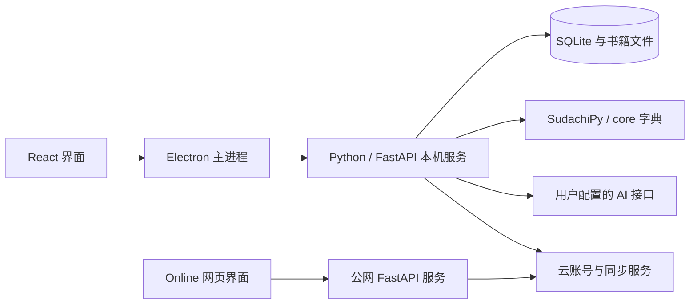
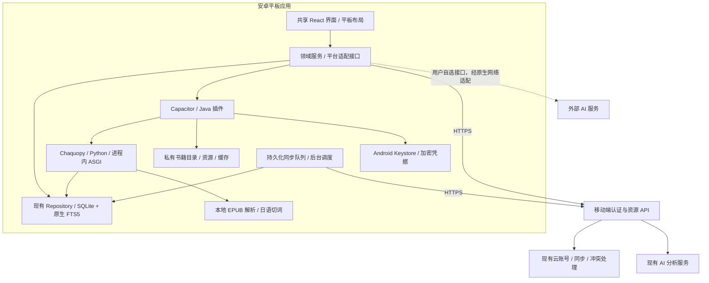

# 冰读安卓平板应用规格说明书

版本：实现规格 1.1 · 日期：2026-10-04  
状态：已建立 Android 工程；验收证据见《安卓安装与验收.md》。设计目标与实际验证范围分别记录。  
基线：现有 Windows 桌面客户端与 Online 公网版本。  
用户已确定：安卓平板版不提供配音，完全排除 YMM4、配音桥、语音包、句子配音与词语播放读音。

## 1. 产品目标与交付范围

提供可以直接安装在安卓平板上的冰读应用：导入日语内容、阅读、理解句意与语法、积累词汇、管理词卡、每日复习、查看学习统计，以及通过云账号或迁移包在设备间继续学习。

首发交付为签名 Release APK、安装说明、功能验收报告、对应版本源码与第三方许可清单。AAB 仅在决定上架应用商店后提供。手机界面须基本可用，首要验收对象是平板。

范围划分：

| 范围 | 要求 |
| --- | --- |
| 保留 | 书架、合集、阅读、词义、AI 修正、语法分析、书签、插图、词库、词卡、复习、学习统计、昵称头像、设置、分享和迁移 |
| 适配 | 触控、横竖屏、多窗口、系统返回、文件选择、分享、下载、本地持久化、弱网和进程恢复 |
| 排除 | 全部配音功能；YMM4 路径与模板设置；Windows EXE、Electron 主进程与桌面菜单 |
| 延续 | 现有快速句意只生成句意，不新增词语翻译；完整释义保留词义与语境义；语法分析明确指出使用的结构 |

本文中的“必须”是最终验收要求，“建议”是实现选择，“待验证”是尚不能承诺效果一致的技术事项。

## 2. 现状与可复用边界

现有仓库采用 React、TypeScript、Vite；桌面端由 Electron 管理窗口并启动 Python/FastAPI 服务。切词使用 SudachiPy 与 core 字典，书库与学习数据保存在 SQLite 和文件目录。IndexedDB 是界面缓存。公网版本另有云账号认证与学习数据同步服务。

复用依据包括 `src/features/reader`、`library`、`cards`、`study`、`activity`、`settings` 和 `sync`。安卓需要平台适配层；现有组件仍直接调用 HTTP 服务，不能仅替换窗口壳就获得完整离线能力。

现有关键兼容合同：

- `backend/modules/data_portability/service.py`：备份版本 1、书籍迁移版本 2；上线时以实际 manifest 为准。
- `backend/modules/sync/repository.py`：同步学习事件、词卡、笔记、书签、进度、偏好和个人词义等；目前不承担完整书籍正文与图片自动同步。
- `backend/modules/cards/scheduler.py`：自研调度模型版本 `ice-fsrs-1`；安卓移植必须保持既有计算和历史语义。
- 最新头像隔离方式：云服务地址与云用户 ID 共同确定账号身份，头像 URL 包含用户标识。

## 3. 技术路线

### 3.1 推荐方案

采用 **React/TypeScript 共享界面 + Capacitor 安卓运行时 + Java 原生插件 + SQLite 本地仓库**。Capacitor 通过原生桥接提供文件、生命周期等能力；不要求将页面全部改成 Ionic 组件。[Capacitor 官方项目](https://github.com/ionic-team/capacitor)、[安卓运行时说明](https://capacitorjs.com/docs/android)。

| 方案 | 与当前项目的关系 | 结论 |
| --- | --- | --- |
| Capacitor + React | 可复用页面、样式、领域类型，原生能力通过插件接入 | 推荐 |
| Kotlin / Compose 全量界面 | 需要重新实现现有阅读、学习和设置界面 | 可作为后续局部性能优化方案 |
| Flutter / React Native | 需要较大规模界面改写，不能直接复用当前 DOM 阅读器 | 不作为本次默认路线 |
| 直接加载公网网页的 WebView | 成本较低，但账号、离线、文件管理和进程恢复仍需处理 | 不满足最终产品规格 |

正式安装包内置界面资源，启动不依赖先下载首页。不能加载任意远程页面并给其开放原生文件接口。

### 3.2 分阶段能力边界

当前实现直接支持本地导入与切词，启动不依赖公网首页。

最终正式版必须支持本地导入、正文阅读、本地句界处理、词典查询、词卡编辑、复习和统计。新的 AI 句意、词义修正、语法分析及云同步仍需联网。离线 AI 不在范围内。

实际构建采用 Chaquopy 17.0.0 嵌入 CPython 3.12，复用现有 FastAPI 的进程内 ASGI 调用、EbookLib 和学习数据仓库。常规 API 不监听 TCP 端口。Pydantic 1.10.22 通过兼容适配保留领域模型接口。切词使用 Java Sudachi 0.7.5 与固定 core 20250515 字典，已在 Android 15 模拟平板上运行。[Sudachi 官方项目](https://github.com/WorksApplications/Sudachi)。

Chaquopy 自带 SQLite 未启用 FTS5；全部安卓仓库使用以 NDK r27d 编译的官方 SQLite 3.46.1，通过自行实现的 ctypes DB-API 适配执行现有 FTS5 查询。安卓进程统一使用此引擎，以维持 WAL 文件锁的一致性。没有用较小字典替代 core。

### 3.3 目标架构

`LibraryRepository`、`LearningRepository`、`IdentityProvider`、`AnalysisProvider`、`PortabilityProvider`、`PlatformFiles` 形成明确接口。桌面、Web、安卓各自实现适配，页面不直接依赖 Electron 或安卓插件。

不增加重复的移动端领域 API，平台桥接维持现有 /api 路由合同。HTTPS 云请求由嵌入 Python 发起；Cookie、刷新凭据和 AI 密钥由 Android Keystore 加密保存。第三方 OAuth 使用系统浏览器与一次性回环回调，要求云端配置对应提供商。

## 4. 平板界面与导航

按应用可用窗口宽度适配，而不是按“设备型号”决定布局。参考安卓窗口尺寸与自适应导航指南；下面的尺寸为产品布局约束，需要实际 WebView 测量校准。[窗口尺寸指导](https://developer.android.com/develop/ui/views/layout/use-window-size-classes)、[自适应导航](https://developer.android.com/develop/ui/views/layout/build-responsive-navigation)。

| 可用宽度 | 应用导航 | 阅读布局 |
| --- | --- | --- |
| 小于 600 dp | 顶部紧凑导航 | 正文为主；目录与释义上下排列，可收起 |
| 600–839 dp | 紧凑导航栏 | 正文为主，目录与释义上下排列 |
| 840 dp 及以上 | 可收起的左侧导航 | 目录 / 书签、正文、释义；允许收起任一侧栏 |

三栏仅在正文净宽仍达到 360 dp 时启用；宽度不足时优先保留正文。外层窗口与正文分别管理滚动，避免嵌套滚动导致错位。

页面结构：

- **入口**：本机模式小字入口；云账号登录、注册、找回密码；已登录后进入相应书架。
- **书架**：最近阅读四本书位于书架上方；合集；导入、分享书籍、载入分享包；真实封面默认隐藏。
- **阅读**：章节标题、正文、阅读辅助、原书预览、全书插图开关、目录 / 书签切换；底部上一节 / 下一节。
- **学习**：个人词库、词语卡片、今日复习均为独立页面。
- **个人主页**：昵称、可裁剪头像、学习时间热力图、连续学习、近期趋势。
- **设置**：阅读与外观、AI、账号与同步、数据管理、关于与许可；没有配音分类。

阅读操作要求：

1. 单击词语查看词义，单击句子查看句意；长按允许系统文本选择，避免阻断复制。
2. 触控目标至少 48 dp；振假名与字号放大不能遮住点击目标。
3. “继续阅读”只显示该文字，不追加书名；从设置、学习页面返回到原章节和句子。
4. 保存 `book_id`、`chapter_id`、`sentence_id` 与句内/段内位置；切分变化时使用文本锚点回退，不能默认回第一节。
5. 系统返回依次关闭临时详情、弹窗、抽屉，再返回上一页面；未保存编辑须提示。
6. 横竖屏切换、分屏调整和应用重建不丢失阅读位置或未提交编辑。
7. 辅助依据位于词义下方；保留手动修正与 AI 修正预览确认。
8. Logo 沿用用户绘制的图案。按本次“无配音”范围，安卓 Logo 不发声，点击返回书架。

## 5. 功能规格与联网矩阵

| 功能 | 最终版离线能力 | 联网能力 |
| --- | --- | --- |
| EPUB / TXT / 粘贴导入 | 无 DRM 文件本地导入、提取章节与图片 | 可选上传到当前云资料空间，必须明确确认 |
| 阅读、插图、原书预览 | 已导入内容完整可用；原书脚本不执行 | 获取用户明确下载的远程资源 |
| 切句、切词、振假名 | 本地处理；复用已有结果 | 可选 AI 边界审校 |
| 句意、完整释义、语法 | 显示已保存结果 | 新建分析与 AI 修正 |
| 词库 | 个人词义与用户导入词典查询、假名树、分页、批量修正 | AI 补充和同步 |
| 词卡、复习 | 候选确认、编辑、标签、四档反馈、撤销、日限额 | 同步学习记录与冲突处理 |
| 学习统计 | 本地计算有效学习时间与热力图 | 合并跨设备事件，避免重复计时 |
| 账号 | 无密码本机资料空间；已绑定云资料空间可离线阅读本地内容 | 云注册、登录、验证、恢复、第三方登录 |
| 分享与迁移 | 选择一本或多本导出、载入分享包与迁移包 | 上传迁移包到用户选定云空间 |
| 配音 | 不提供 | 不提供 |

网络不可用时，AI 按钮说明“联网后可生成”，已保存内容继续可读。不能把整个阅读页阻塞在加载画面。离线修改先写本地再进入同步队列，符合安卓离线优先架构原则。[安卓离线优先指南](https://developer.android.com/topic/architecture/data-layer/offline-first)。

## 6. 账号、头像与云端互通

1. 本机资料空间不设置密码；每个空间使用稳定的本机 UUID。
2. 云身份以服务端签发并验证的 `issuer + subject` 为依据，不使用昵称、邮箱或客户端提交的用户 ID 判定权限。
3. 同一云账号在不同设备对应同一云身份；本地数据库以“服务来源 + 云用户 ID”分区。绑定本机空间需提供迁移预览，不能覆盖另一个账号。
4. 切换账号后取消旧账号请求、清空界面缓存与图片请求状态、切换数据库上下文；请求响应必须校验所属账号与切换代次。
5. 头像存储、缓存键和资源请求均带用户身份；头像版本独立更新。重复 A→B→A 不串头像、昵称、书籍或学习数据。
6. 刷新凭据不存 Web localStorage。由 Java 使用 Keystore 管理加密密钥，在私有存储保存加密凭据；访问令牌尽量只保存在内存。
7. 原生第三方登录采用系统浏览器、授权码 + PKCE、state/nonce 和经过验证的回调，不在内嵌 WebView 中收集第三方账号密码。[RFC 8252](https://www.rfc-editor.org/rfc/rfc8252)。
8. 邮箱验证、找回密码、第三方登录依赖服务端邮件与身份提供方实际配置；开发模式不能作为正式可用证明。
9. 移动端鉴权适配必须验证云访问令牌并映射到现有资源归属，再调用共享服务。不能把安卓持有的云 token 当作现有网页本地会话 token 使用。
10. 退出账号撤销本设备会话，保留或删除离线资料由用户选择；不撤销其他设备会话。管理员入口仅对经过服务端授权的管理员显示。

## 7. 本地存储、同步与迁移包

### 7.1 存储合同

- SQLite 是书库、词库、词卡与学习状态的持久化来源；IndexedDB 仅用于可丢弃的页面缓存。
- 文件位于应用私有目录，按账号分区；书籍原文件、图片、分析结果和迁移临时文件分别管理。
- 不将大文件经 JavaScript 桥接转成整块 Base64；导入、校验、导出在原生侧流式处理。
- 数据库更新采用有版本的迁移与事务；升级失败须保留原数据并显示可恢复错误。
- 所有字符串按 UTF-8 处理；中文昵称、日文书名、文件名须回归测试。

### 7.2 同步合同

- 延续现有实体类型与版本语义，复习日志和学习事件保持追加语义；笔记冲突保留分支并由用户解决。
- SQLite 事务同时写业务记录和 outbox；批次有幂等 ID，重复发送不得重复复习或计时。
- 显示“立即同步、拉取数据、冲突处理、绑定云账号”，并显示待同步数量、最后成功时间与错误。
- 429 尊重 Retry-After，网络重试集中在单层协调器；不再叠加请求、JSON 与拆批重试。
- 使用 Android 后台调度处理允许延迟的同步；系统可能推迟执行，界面不得承诺退出应用后立刻完成全书分析。
- 书籍与资源传输单独设计校验、大小限制、断点与删除策略；首发仍通过分享包/迁移包传输完整书籍，不能宣称现有学习同步会自动带来所有书籍。

### 7.3 包兼容

| 包类型 | 要求 |
| --- | --- |
| 书籍分享包 | 一本或多本；包括原文、图片、切分、翻译及相关词义；不包含私人进度、书签、卡片与学习记录 |
| 跨账号迁移包 | 包含书籍、个人词库、词卡、复习状态、进度、书签与学习记录；不包含密码、token、AI 密钥 |
| 完整备份 | 安卓有自己的版本化备份；敏感设置仅允许加密导出；不承诺直接还原 Windows 原始数据库备份 |

安卓导入桌面包后须重写资源引用、映射用户归属，并保留已有句子 ID 与切分、翻译完成状态。包中含有桌面配音设置时跳过并提示，不据此恢复任何安卓配音功能。

包校验必须包括 manifest 类型、版本、校验和、资源引用与学习记录关系；拒绝路径穿越、解压炸弹和未知危险内容。导入失败不得留下半本书；目标已有书籍按现有规则跳过，并列出结果。

## 8. 安卓系统适配

- 使用 Storage Access Framework 选择 EPUB、TXT 与 ZIP，保存导出包到用户选择位置；不申请整个磁盘访问权限。[安卓文件选择指导](https://developer.android.com/guide/topics/providers/document-provider)。
- 导入后复制至私有目录，撤销源文件授权不影响已导入书籍。
- 支持系统“打开方式”和分享菜单；未知 MIME 需结合文件签名与扩展名验证。
- 使用安卓图片选择器设置头像，保留圆形预览、缩放和移动裁剪。
- 适配系统边距、手势导航、软键盘、多窗口、字体缩放、蓝牙键盘及鼠标。
- 失焦、进入后台与页面卸载前保存阅读位置；进程被系统杀死后从持久化状态恢复。
- 按书可选保持屏幕常亮；仅阅读前台生效。
- 发布更新使用固定包名和签名证书；安装覆盖升级保留数据。卸载会移除私有数据，卸载前提供导出入口。

## 9. 安全与许可

原书 HTML 中的脚本、事件属性、危险 URL 与外部加载必须过滤；预览放入不开放原生桥接的隔离上下文。只允许经授权的本地资源与明确外链。

云端与外部 AI 默认使用 HTTPS；不为解决连接问题全局关闭证书校验。所有原生桥接方法使用允许列表，不接收任意文件路径、SQL 或执行命令。

日志、崩溃报告、迁移包和截屏诊断不包含密码、token、AI 密钥或书籍全文。需要上传书籍/句子用于分析时，在对应入口说明数据去向。

沿用项目 AGPL-3.0-or-later 代码许可，为 APK 提供对应源码、构建步骤和依赖声明。新增安卓依赖、切词引擎与字典分别审核许可证。Logo 是用户绘制的东方 Project 琪露诺非官方二次创作，按现有 NOTICE 排除在软件代码许可证之外，不改变原作权利与非官方声明。

## 10. 性能与兼容目标

以下是拟定验收目标，尚非实测结果：

| 项目 | 目标 |
| --- | --- |
| 系统 | 最低拟定 Android 10；覆盖 Android 10 至发布时稳定版本；最终与所选 Capacitor/插件最低版本取更严格值 |
| 设备 | 8–13 英寸平板；横竖屏、分屏；最低 3 GiB RAM，推荐 4 GiB 或以上 |
| 架构 | 首发 arm64-v8a；模拟器 x86_64 用于测试；其他架构另行验收 |
| 冷启动 | 基准 4 GiB 真机上，已有本地账号进入可操作书架 P95 ≤ 3 秒，至少 20 次测量 |
| 续读 | 本地已处理章节打开并定位 P95 ≤ 1.5 秒，至少 50 次测量 |
| 规模 | 1,000 本书索引、20,000 张词卡、100,000 条个人词义，搜索与列表不全量加载 |
| 内存 | 常规阅读峰值 PSS 目标 ≤ 350 MiB；core 字典初始化单独测量，超标须调整方案 |
| 大文件 | 至少验证 200 MiB EPUB、500 MiB 迁移包；更大包按设备可用存储明确限额 |
| 后台与离线 | 飞行模式阅读和复习 30 分钟可用；强制结束后恢复，无数据库损坏 |

SDK、JDK、Gradle、Capacitor 与插件版本在技术验证阶段固定并写入锁文件，不使用 `latest` 构建正式版。targetSdk 在发布时按渠道要求校验，不在本规格中猜测未来要求。

## 11. 实施阶段与阶段验收

| 阶段 | 工作 | 通过条件 |
| --- | --- | --- |
| A：技术验证 | 安卓工程、共享界面启动、文件选择、SQLite、登录桥接、core 字典与 EPUB 可行性 | 真机运行；内存和耗时记录；确定本地切词与解析路线，不虚报兼容 |
| B：阅读测试版 | 平板导航、书架、服务端分析适配、下载已处理书籍、离线阅读、进度、插图和书签 | 横竖屏与分屏可用；断网仍可读；退出/重启精确续读 |
| C：离线学习 | 本地导入、切句切词、词库、词卡、调度算法、统计、平台仓库适配 | 未连接云账号也能完整进行本地阅读与复习；算法对照通过 |
| D：云与迁移 | 原生安全登录、账号隔离、头像、outbox、冲突、分享和迁移包 | 两账号多设备互切无串数据；包往返校验；中断重试幂等 |
| E：发布验收 | 无障碍、生命周期、安全、性能、升级、签名、源码和许可 | 全部 P0 验收通过，交付签名 APK、校验和及验收记录 |

每阶段验收完成才进入下一阶段；阶段 B 的测试 APK 标明服务端依赖，不按最终完整功能版发布。若阶段 A 的本地切词路线不通过，先修订技术方案并记录能力差异，再进入正式实现。

## 12. 必须通过的验收场景

1. **账号隔离**：A 与 B 各设置不同头像和昵称，互切至少 10 次并重启，内容、缓存和个人设置无串号；旧请求晚到不能修改新账号界面。
2. **准确续读**：选择非第一节中部句子，进入设置后返回、旋转屏幕、重启、系统结束进程，均恢复到同一阅读锚点。
3. **离线学习**：本地导入未分析 TXT/EPUB，断网切词、查已有词义、加卡、复习和看统计；AI 明确不可用但不阻断正文。
4. **语义一致**：建立至少 200 个日语句子、10 本不同结构 EPUB 的对照集合；覆盖 ruby、青空换行、引号、插图、标点与日文文件名。所有差异需评审，错误偏移、丢章节和丢插图为 P0。
5. **调度一致**：用桌面计算生成固定对照数据，四档反馈、时区、历史复习、撤销及跨设备重放结果一致，不能随平台改变模型版本。
6. **迁移往返**：Windows→Android→Online，校验书籍、图片、切分、译文、词卡与学习记录；分享包确认不泄露私人学习数据。
7. **同步失败**：网络断开、401、429、5xx 和重复响应后无重复复习日志；能重新认证或手动重试，不丢本地修改。
8. **恶意内容**：EPUB 的 `javascript:` 链接、事件属性、脚本和 ZIP 路径穿越被阻断，原书预览不能调用原生插件。
9. **平板布局**：横屏、竖屏、窄分屏、系统大字体、键盘弹出时，无关键按钮被遮挡或正文溢出。
10. **版本升级**：同签名覆盖安装后本机与云资料均保留；数据库迁移异常能回退；发布包没有调试证书、密码或测试账号。
11. **无配音**：APK、设置、阅读页、词义卡、Logo 点击与相关网络调用均没有 YMM4 或配音入口、依赖和请求。

## 13. 交付清单与后续待定项

交付清单：规格与架构图、安卓工程、平台适配接口、数据库迁移、兼容性对照数据、签名 APK 与 SHA-256、安装升级说明、验收报告、对应源码与第三方清单。签名密钥单独备份，不提交仓库。

开发前仍需实际确认：用于验收的平板型号、Android 版本与内存；本地切词性能；导入器兼容性；邮件/OIDC 服务配置；发布包名、签名保管方式与分发渠道。这些不阻止先做技术验证，但都必须在正式发布前关闭。

本规格仅定义安卓版，不自动改动 main 与 Online 的现有发布行为。文档先保存在本地 `build/specifications`，不自动提交或推送 GitHub。
