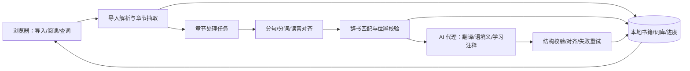

# AI 日语精读器：架构与技术栈建议（决策草案）

> 版本：0.2；更新日期：2026-09-26。目标是把用户上传的电子书转换为 Satori Reader 式学习材料。此文给出可执行的首版方案与备选项，尚未做项目技术决策。

## 1. 研究依据与结论边界

我检索了 [SciSpace 上的日语形态分析论文](https://scispace.com/papers/applying-conditional-random-fields-to-japanese-morphological-159mtfathe)：它指出日语词边界存在歧义，支持把“分词”当作独立的语言处理问题。关于多义词，[ACL 的上下文词义消歧研究](https://aclanthology.org/D19-1533/)表明上下文信息对判义有价值。论文提供问题建模依据，**不证明某一现成模型或本项目组合方案必然达到特定准确率**。本环境未提供可调用的 SciSpace 应用接口；SciSpace 公开论文页与论文原站、项目官方文档是本次依据。

## 2. 架构目标

架构需要支持两层内容：第一层是用户上传且不可被 AI 改写的**出版物层**；第二层是可以更新、重试和人工修正的**学习注释层**。Satori Reader 的内容由编辑预先制作，本产品要用可校验的 AI 流水线动态生成学习注释，因此注释的版本、来源、失败状态和原文锚点都必须成为正式数据。

## 3. 推荐架构：本地阅读、按章预处理、服务端代理 AI



推荐首版为单机使用的 Web 应用：阅读数据、词库、进度存浏览器 IndexedDB；一个轻量后端运行日语分词，并代理云端 AI 请求。这样 API 凭据保留在服务端，分词结果也可固定版本。若产品计划部署给多人，服务端仍需加入身份认证、额度控制和用户隔离，不能直接沿用单机配置。

### 处理流水线

1. **导入**：解析 EPUB/TXT，保留原文、章节、段落和章节内字符偏移。保留原 EPUB 资源与结构映射；不要把文本分割后的 HTML 当作唯一原件。
2. **基础分析**：句子切分；用 SudachiPy 生成候选词边界、词典形、读音、词性。针对学习者可测试 B 模式作默认值；复合词出现不自然边界时提供 C 模式候选或人工修正。Sudachi 的 A/B/C 粒度及字形规范化见[项目文档](https://github.com/WorksApplications/Sudachi)。
3. **候选词义**：用词典资源匹配词条；本地词库已存在的词条直接复用。批量找出缺失的 `lemma + reading + 词性`，只为缺失项生成或补充通用解释。JMdict 可作结构化候选源，但它的现成释义并不保证满足简体中文需求，使用前检查具体语言覆盖与质量。
4. **AI 学习层**：按句或短段生成中文译文、词元当前义和必要的学习注释。注释类型包括语法结构、语气/语用、省略/指代和文化背景。传入固定 sentence/token ID、原文范围及词典候选义，要求返回 ID 与原文锚点的结构化映射。
5. **严格校验**：先检查句子 ID、词元 ID、数量、原文偏移、是否遗漏及不合法字段，再写入本地数据库。无效批次只重试相关句，原文始终可用。
6. **阅读**：按可见章节或段落渲染词元和 ruby。浏览器 hover/focus 整个词元节点；点击用 token ID 取得通用义及语境义。侧栏按 sentence ID 展示译文与句子注释。

### 3.1 两级 AI 处理策略

- **章节预处理**：进入阅读前生成分句、分词、读音、句译和基础注释，保证阅读时不频繁等待。
- **按需深度解释**：用户点击“深入解释”时，使用当前句、前后句和章节术语表生成更详细说明。该结果另行缓存，不阻塞首轮处理。
- **全书一致性**：先提取人物名、地名、专有名词和固定译法形成书级术语表，随后按章处理；用户修改术语后只重算受影响的句子。
- **重复内容复用**：通用词条跨书复用；语境义、句译和语法注释按原文内容散列、上下文范围、提示版本和模型版本缓存。

### 关于“片假名树”

物理存储推荐 IndexedDB 的 `lexeme` 表加 `firstKana`、`readingKatakana` 和复合唯一键索引；逻辑上在查询层构建片假名 Trie。每条记录按规范化读音的首个片假名归入一棵子树，之后逐字检索。这样既满足用户按首音浏览，也方便修改释义、管理同音异义和数据库升级。只以首个片假名为键会产生大量冲突，不能承担去重。

```text
Lexeme: id, lemma, readingKatakana, firstKana, partOfSpeech,
        senses[], source, sourceVersion, updatedAt
ContextSense: sentenceId, tokenId, lexemeId, selectedSenseId?,
              glossZh, source, modelVersion, confidence?, correctedByUser
Token: tokenId, sentenceId, start, end, surface, lemma, reading, partOfSpeech
Sentence: sentenceId, chapterId, start, end, original, translationZh, status
Annotation: annotationId, sentenceId, type, anchorStart, anchorEnd,
            explanationZh, source, modelVersion, correctedByUser
BookGlossary: bookId, surface, canonicalName, translationZh, aliases[], source
StudyState: userId?, lexemeId, status, lookupCount, examples[], updatedAt
```

缓存键包含规范化结果和词典/模型版本。用户修正优先级高于自动结果。通用词条按词库去重；语境义按所在句缓存。更新模型或辞书时不要静默覆盖用户修正。

## 4. 建议技术栈

| 层 | 首选 | 选择理由与备选 |
| --- | --- | --- |
| 前端 | TypeScript + React + Vite | 容易把阅读器、侧栏和进度拆成组件；若团队已有 Vue 经验可等价替换。 |
| EPUB 渲染 | [epub.js](https://github.com/futurepress/epub.js/) 做可行性验证 | 支持浏览器 EPUB 呈现、章节、位置 CFI；需要验证它的 iframe 内容与自定义词元/句子标记能否稳定共存。若无法可靠对齐，首版采用解析后重排的阅读视图。 |
| 日语处理 | Python + [SudachiPy](https://github.com/WorksApplications/SudachiPy) + SudachiDict Core | 可得到多粒度词元和规范化词形；辞书文件和版本固定。可对比 MeCab/fugashi，但以真实小说样本和操作复杂度决定。 |
| 本地持久化 | [IndexedDB](https://developer.mozilla.org/en-US/docs/Web/API/IndexedDB_API/Using_IndexedDB) + [Dexie](https://dexie.org/docs/API-Reference) | 支持结构化索引和离线复用。浏览器配额与清理行为需测试，并提供导出备份；[MDN 配额说明](https://developer.mozilla.org/en-US/docs/Web/API/Storage_API/Storage_quotas_and_eviction_criteria)。 |
| 后端 | Python FastAPI + 本地任务队列/持久化任务表 | 与 SudachiPy 同语言，易封装 AI 请求、超时、重试和进度；多人并发后再评估正式队列。 |
| AI 接入 | 可替换 provider adapter + 结构化 JSON Schema 输出 | 分开定义翻译、语境义和注释 schema，保存提示与模型版本；先用真实小说评测后再选服务商。 |
| 基础词典 | [JMdict](https://www.edrdg.org/wiki/JMdict-EDICT_Dictionary_Project.html)（候选） | 开放结构化词典可降低纯 AI 造义风险；[EDRDG 许可](https://www.edrdg.org/edrdg/licence.html)要求署名及对衍生数据遵守相应条件，发布前审核分发方式。 |

### 4.1 备选部署形态

| 方案 | 适合情况 | 代价 |
| --- | --- | --- |
| A. 本地 Web + 本机后端（推荐原型） | 先验证导入、分词、语境翻译和词库逻辑；无需账号。 | 用户要启动本机服务，跨设备困难。 |
| B. 托管 Web + 服务端 API | 希望用户打开网址即可用。 | 需账号/隔离、文件存储策略、AI 费用控制及运维。 |
| C. 浏览器纯前端 + 用户直连 AI | 极简部署且无需后端。 | 凭据暴露、日语分词依赖及浏览器算力、跨域和安全策略更复杂；不建议作为默认发布方案。 |

## 5. 关键接口建议

```text
POST /books/import              # 上传或提交文本，返回 bookId/章节清单
POST /chapters/{id}/process     # 幂等启动章节处理
GET  /chapters/{id}/status      # 状态、阶段、进度、失败位置
GET  /chapters/{id}/analysis    # 句子、词元、译文、语境义（分页）
GET  /lexemes/{id}             # 通用词条；优先从本地缓存读取
POST /sentences/{id}/explain   # 按需生成更深入的句子解释
POST /chapters/{id}/retry       # 仅重试失败片段
```

若书籍全部存浏览器端，API 不必接收整本书：客户端可按章提交正文到本地后端，返回分析结果后写入 IndexedDB。托管服务的隐私与数据保存策略需另行设计。

## 6. AI 注释质量标准

对标 Satori Reader 的重点不是功能名称，而是注释确实能帮助学习者理解原句。建立小型人工金标准集，并分别评估：

| 指标 | 需要检查的错误 |
| --- | --- |
| 原文对齐 | 译文、词义或注释绑定到错误句子或错误词语 |
| 分词与读音 | 复合词被不合理拆分、活用形还原错误、读音错误 |
| 语境选义 | 使用了存在于词典但不符合当前句的含义 |
| 句译忠实度 | 漏译、擅自补充信息、人物关系或语气错误 |
| 注释价值 | 重复译文、解释常识、遗漏关键省略或语法、虚构文化背景 |
| 全书一致性 | 人名、术语、代词指代或固定表达前后不一致 |

首轮评测至少覆盖对白、叙述、敬语、口语缩略、拟声词、多义词、专有名词和带振假名内容。每次更换模型、提示词、辞书版本或分词方式都用同一数据集回归。

## 7. 质量、安全与成本验证

- **分词样本**：抽取小说对白、汉字复合词、活用形、人名、拟声词、带振假名文本，人工标注词边界；比较 A/B/C 粒度和点击体验。日语词边界歧义有研究依据，详见[SciSpace 收录论文](https://scispace.com/papers/applying-conditional-random-fields-to-japanese-morphological-159mtfathe)。
- **语境质量**：人工审阅 100–200 个多义词实例及其句译和学习注释，分别记录边界错误、词典形错误、选义错误、译文错误和无价值注释。设置接受阈值后再选模型和提示词。
- **缓存效果**：在重复章节和跨书重复词上统计通用词条命中率、AI 请求数、单章成本；检查同形异读或同形异义没有误命中。
- **位置稳定性**：改变字体、窗口和横竖排，验证句子定位及阅读进度。epub.js 提供 [CFI/位置 API](https://github.com/futurepress/epub.js/blob/master/documentation/md/API.md)，但自定义分词 DOM 对 CFI 的影响需实测。
- **不可信 EPUB**：禁止脚本执行、拦截外部资源、清理 HTML，并设置压缩包大小/解压上限。[epub.js 文档](https://github.com/futurepress/epub.js/)明确提示内嵌脚本的安全风险；[W3C EPUB 3 说明](https://www.w3.org/TR/epub-overview-33/)也允许阅读系统禁用脚本。
- **浏览器数据**：测试存储不足、无痕模式和清理站点数据后的行为，提供导出备份。IndexedDB 存储受浏览器配额与清理策略影响。[MDN](https://developer.mozilla.org/en-US/docs/Web/API/Storage_API/Storage_quotas_and_eviction_criteria)

## 8. 实施顺序与决策点

1. **Satori 式纵向原型**：用一章真实 EPUB 跑通导入、分词、逐句译文、重点语法注释、假名显示、悬停整词、语境查词和词条复用。先验证稳定的原文锚点和侧栏体验。
2. **阅读 MVP**：全书/章节处理任务、错误重试、本地数据、进度恢复、显示偏好、导入预览和基础安全防护。
3. **学习闭环**：上下文词卡、已知词状态、学习统计和导出。
4. **准确率迭代**：构建人工金标准集，调整分词粒度、词典源、书级术语表、提示词及模型；加入用户修正和局部重算。

开工前由产品负责人确认：**部署形态、AI 付费与凭据方案、中文词典来源、EPUB 原版式保真程度**。这四项会影响架构，但不会改变上面的核心数据模型。
