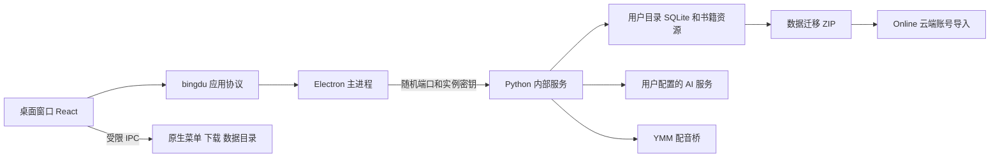

# 冰读本地客户端重构计划书

## 目标与范围

main 改为 Windows 桌面客户端，Online 保持公网 Web 产品。阅读、导入、插图、合集、书签、切分、翻译、语法、词典、配音、词卡管理、复习、学习统计、用户资料和设置全部沿用现有实现。云账号不作为本地客户端的使用前提。本地用户的书籍、资源、卡片、复习状态与学习记录可通过迁移包导入另一账号，包括云端账号。

## 参考与选择

- [aozora](https://github.com/meokisama/aozora) 使用 React、Electron 和 Electron Forge。借鉴进程分工，不复制其 GPL 源码。
- [Electron 安全指南](https://www.electronjs.org/docs/latest/tutorial/security)：隔离上下文、关闭 Node 集成、启用沙箱、限制导航和 IPC。
- [Electron protocol](https://www.electronjs.org/docs/latest/api/protocol)：使用固定的应用协议，使浏览数据不依赖临时服务端口。

选择 Electron + 现有 React + Python 内部服务。重写 NLP、SQLite、AI 与 YMM 接口会增加功能回归风险，因此保留这些领域模块。客户端有独立窗口与生命周期，不再调用系统浏览器。Python 打包为目录形式，不要求用户安装 Python，不做每次解压的单文件启动。

## 架构

渲染进程不直接访问文件系统、操作系统或进程。固定协议代理同源 API、图片、音频及原书预览。内部服务只监听回环地址，并校验随机密钥。主进程启动服务、等待健康检查、管理会话、处理下载，并在退出时停止服务。外部网页不能访问内部 API。崩溃时显示可操作的错误，日志保存在数据目录。

## 数据与兼容

数据放在系统用户目录，应用安装与升级不会覆盖数据。首次启动从旧项目或旧目录版复制数据，SQLite 使用 backup API 生成一致快照，原数据保留。迁移完成标志最后写入；失败可重试。内置词典作为只读安装资源，在首次启动初始化。

迁移包升级为版本 2，同时接受旧版本 1。包含书籍与所有相关资源、阅读进度、书签、个人词库、卡片、记忆状态、复习日志和学习时间。排除账号密码、会话、AI 密钥和云绑定。导入时重映射用户与学习对象 ID，保留目标账号原数据，重复导入不重复新增。Online 仅更新迁移包兼容模块，不加入桌面壳。

## 实施阶段与验收

1. **桌面运行时**：增加 Electron 主进程、受限 preload、内部服务入口、实例隔离、启动/退出与错误处理。验收：启动真实原生窗口，页面 API 和静态资源正常，第二实例不另开服务，无密钥请求被拒绝，退出后无残留服务。
2. **数据与功能兼容**：迁移旧数据、持久会话、原生下载、设置中的客户端信息。验收：重启数据和登录保留；导入、阅读、切分、词典、图片、音频、卡片、学习页面可通过同一 API 工作。
3. **完整迁移包**：升级导出和合并导入，更新 UI、类型、测试和 Online 兼容。验收：跨账号书籍资源、卡片、复习状态、学习记录完整；重复导入幂等；目标既有数据保留；旧包仍可导入；不携带密钥。
4. **发行包**：打包 Python 内部服务与 Electron，保留 logo 图标，提供安装包和可直接运行的目录版。验收：目录版不依赖开发环境，安装资源不包含个人数据库或专有 YMM 软件，构建结果可启动，数据目录与程序分离。
5. **最终回归**：运行后端现有测试、前端编译、桌面自动化测试和打包启动测试，记录实际结果。功能依赖 AI、云端或 YMM 的场景保留原接口，并单独标注外部服务条件。

## 完成记录

2026-10-03：各实施阶段已完成。main 为 Electron 桌面版，Online 保持 Web 版；两分支更新已分别提交。

| 阶段 | 实际验收结果 |
| --- | --- |
| 桌面运行时 | 真实原生窗口启动成功；沙箱与上下文隔离启用、Node 集成关闭；无实例密钥的请求返回 403；重复启动退出；关闭客户端后内部服务进程消失。 |
| 数据与功能兼容 | 目录版真实启动、刷新和重启保持会话与数据；EPUB/TXT 导入、本地切分、插图、原书预览、音频范围请求、卡片搜索、阅读句子定位与从设置返回阅读通过自动化验收。 |
| 旧版迁移 | SQLite WAL 快照、重复迁移和中断后的资源补复制通过测试；实际旧目录版 19 本书已复制到独立验收目录，原数据保留。自动检测在多个旧数据目录中选择最近使用的一份。 |
| 完整迁移包 | 跨账号卡片、复习历史、知识记录与学习时间合并通过测试；同账号及跨账号重复载入不重复创建卡片，保留目标既有数据；旧版本 1 包仍可载入；迁移包排除 API 密钥和账号凭据。 |
| Online 兼容 | 已部署版本 2 导入器及新设置 UI。服务器隔离资料空间实际迁入 1 本书、1 张卡片和 3 条相关记录；再次载入新增卡片 0、跳过已有书籍 1。 |
| 发行包 | Windows x64 安装包与目录版均已生成；打包版本无需开发 Python，内置 435,448 条日中词典记录，实际查词通过；程序目录不包含用户数据库、YMM 软件或专有语音包。 |
| 回归 | 前端 TypeScript/Vite 构建通过；后端 108 项测试通过；开发版与打包版桌面端到端验收通过，并检查了实际渲染截图。 |

## 使用与外部条件

- 直接运行项目根目录 `冰读.exe` 或完整目录版 `build/desktop-release/win-unpacked/冰读.exe`；也可安装 `build/desktop-release/IceReader-0.3.0-Setup.exe`。
- 数据固定保存到 `%APPDATA%/IceReader/data`；设置页可以打开该目录。目录版和安装版使用同一持久目录。首次自动复制原数据；也可在首次运行前设置 `BINGDU_LEGACY_DATA_DIR` 指定旧目录。
- 如需迁到云端：本地设置页下载跨账号数据迁移包，登录 Online 目标账号后在设置页载入。
- 现有 AI、YMM 配音桥和可选云端同步模块继续保留。真实 AI 请求仍需用户的有效接口和额度，配音仍需本机安装且具有相应许可的 YMM/语音引擎。回归验证了现有模块与桌面传输通道；本轮没有为测试产生付费 AI 请求，也未重新申请第三方 OAuth 凭据。
